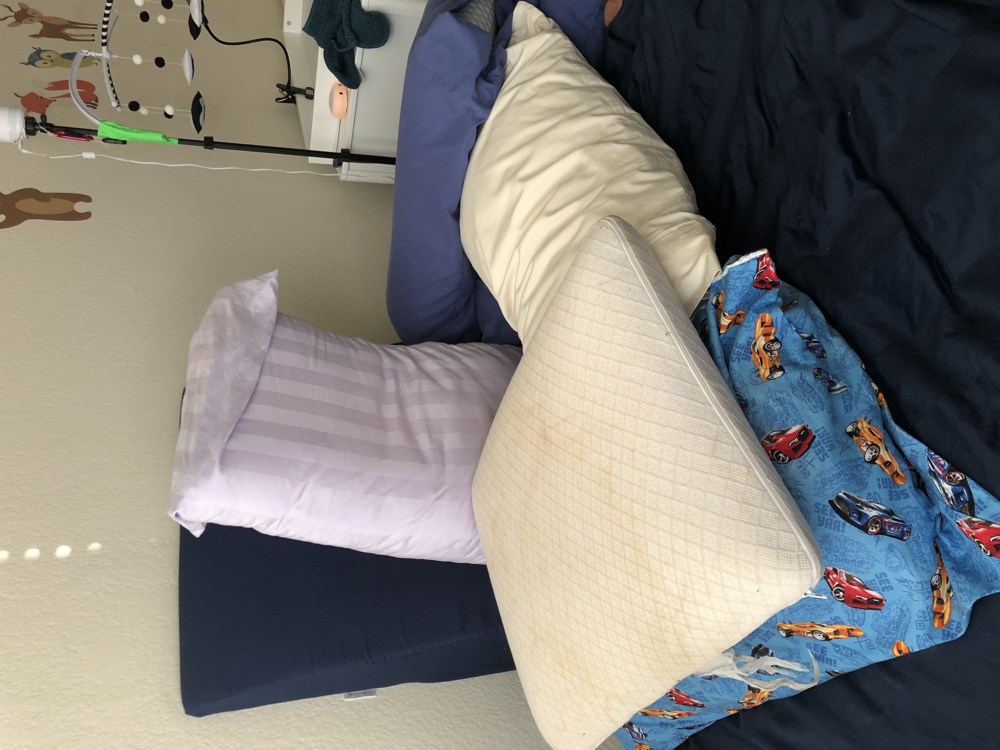

# Our Breast Feeding Journey

After 42 days of strenuous effort, breastfeeding finally feels as advertised. Mama looks forwards to feeds during which she and baby experience a magical bonding. Mama and baby become one in mind body and spirit. Mama's breasts know when it's time to feed, and hearing baby's gentle hunger cries triggers milk let down. Mama can read baby cues like an open book. She knows when baby is frustrated by gas, and patiently helps baby process. She knows when baby is still hungry despite sleepiness, and that baby enjoys encouragement and speaking to. Nowadays, baby will even take breaks just to smile brightly at mama - baby's one true love. Mama relishes knowing that she gives baby both a nourishing meal, and emotional comfort. It's quality time worth every ounce of effort.

There are additional convenience benefits as well! It's nice not to wash bottles, or anticipate how many ounces of milk baby needs, or not needing to pump.

That being said, getting to this state was not easy. It was the hardest 42 days of mama's life.

Establishing breastfeeding was very difficult; a journey ripe with tears, blood, hopelessness, a desire to quit, and sometimes regret.

At its very worst, mama would describe breastfeeding as taking a razor blade to your nipple 4 times per feed, 8 feeds per day, with seemingly no end in sight. The most painful part wasn't the acute pain during feedings, it was watching mama's emotional damage transform her in between feedings. She oft entered a pseudo-depressed state between feedings where her personality withered and she relied on consuming content from audio books or netflix to stay present. We watched mama break down before a feed in anticipation of the pain. We watched a confident, cheerful, playful person subject herself willing to torture and become a scared, paniced, fearful, mopey shell of her former self, all while forcing herself to put on a mask of happiness.

Throughout this journey, mama would often feel inadequate as a mother and a woman. "Why can't I feed my own baby who depends on me? Why don't I have the maternal instincts to align baby correctly? Why am I so broken?"

We were so underslept, our emotional control and mental strategies to stay positive escaped us.

Days could not be any longer. Breastfeeding did not feel like a magical moment between mother and child. Instead it caused an active rift where Mama was less present than ever. Mama watched Dodo videos and listened to audio books during feedings to numb the pain, and was distract during play sessions with baby due to emotional distress.

We would often find signs here and there that gave us hope, only to watch some set back knock us down lower than ever.

For example, our lactation consultant (LC) informed us that so long as baby has a good latch, there the extreme pain will end in 1-2 weeks after Mama's nipple "leatherizes". Our LC confirmed our baby had a good latch! We steeled our resolve and toughed out the next two weeks, hopeful for the payoff! But sadly, the pain persisted. Upon another consultation, we were provided no solutions, just that there should no longer be pain.

At this point, we could have a) seeked out a fourth or fifth opion, b) suffer for another two weeks hoping that Mama's nipple is just slow to "leatherize", c) wait two more months for baby's mouth to get bigger, or d) give up on breastfeeding help reassure Mama there is no shame in doing so.

Stubborn as a taurus, Mama wanted to endure the pain for another 3 months. Not sure Papa woud've been able to watch Mama in her distress for much longer though...

Fortunately for us, things did get better!

One day, at 5 weeks old, grandma (bubbe) was holding baby who started fussing. Rocking in the glider did not soothe. LCs advised against pacifiers as they may cause nipple confusion (state where babies refuse breast in favor of bottle), so bubbe's only remaining option was to bounce the baby. However, poor bubbe who had bounced baby all day, done multiple loads of laundry, re-organized the house, vacummed the carpet, and cooked mama and papa three five course meals, no longer had the bicep strennth or stamina to bounce baby. Desperate to soothe baby to provide mama more sleep, bubbe resorted to a makeshift pacifier - her pinky.

Baby sucked on pinky for about 45 minutes before crying due to hunger. The next feed was different. Papa is a bit vocab challenged (in his defense english isn't his first language!!) and noted "something about this feeding is amiss." The feeding went excellently! Baby opened huge for the breast and latched on deeper than ever before! Baby sucked slow and rhythmically, in large gulps! Mama's nipple still hurt in the beginning for about a minute, but after that, there was no pain! This was consistent with how LC said breastfeeding should feel! Typically baby would be so frustrated and fussy during feeds that baby would shake head around, un-latch and re-latch frequently, but this time baby stayed on a single latch for 20 minutes!

We realized that baby was too frustrated or hungry before feeding in order to feed properly! We were confident, in hindsight, the cause was bubbe's makshift pacifier, but at the time, there were many changed variables, and we need to experiment during the next two to three feeds.

But finally, after some experimentation, we found we could consistenly get a good feed by introducing a pacifier pre-feed! (be careful! LCs worry introducing a pacifier too soon can lead to nipple confusion - more below).

We finally rounded a corner in our breastfeeding journey and things got easier! We saw consitently strong latches feeding after feeding. Our emotinal moods restored, and spirits lifted!

Mama is back to her old self! And now having so much fun with breastfeeding! Such a relief lifted off of our shoulders! All the things people told us along the way (oh he'll get the latch eventually, etc) did not seem achievable, but we got there, in our own time!

And now, as we Mama and Papa discuss the contents of this blog post, we reflect on how crazy it is that now, the memories of the pain are disappearing into oblivian.

We share this post in hopes that future parents don't feel as alone as we did. We document specifically what we did to finally acheived breastfeeding, and try to be as transparent as possible to arm future breast feeding parents with yet another case study.

Disclaimer: All content is this document is specific to our own journey. Learnings and tips that helped us, may not help you. Each baby is different.

## TL;DR - Breastfeeding tips for new parents

- Get a good lactation consultant before birth.

  - They can be expensive. Perhaps family can chip in? Certainly worth it
  - A potentially cheaper alternative: Join/attend La Leche League (breast feeding support group) meetings locally, and see if any member would be happy to serve as essentially and LC

- Put in time to make breastfeeding setup ergonomic - a) this affects baby's latch (good alignment pre-requisites a good latch) and b) mama will spend a lot of time here.

- Lean on support person to help with latch, and restrain hands. Support person has a much better viewing angle that helps with telling mama when baby's mouth is fully open, spotting issues with baby's alignment, etc.

- Don't let baby get lazy; Do not reward bad latches with milk.

- Defussify baby before feeds!

  - LCs recommended skin-to-skin contact
  - Do de-gassing exercises on baby pre-feed
  - [untested theory/experiment] feed baby before their gas attacks start
  - [not exactly LC recommended, but worked wonders for us, we waited until baby was 5 weeks old - TRY ONLY AT YOUR OWN RISK] - give baby pacifier before feeds.

- Don't ride the emotional roller coaster; remember reversion to the mean. Exceptionally good and bad feeds are outliers that do not dictate the story.

- If breast is engorged, hold the sandwhich, or slightly dis-engorgify!

- Silverettes are magical for healing cracked nipples!

  - Be sure to get actual silver, and don't use creams simultaneously, as it's the metal-to-skin contact that makes the difference

- Keep experimenting! Do not resign to discomfort.

- Comparison is the theif of joy; everyone at their own pace.

- Ignore pressure from medical establishment that push shame for NOT exclusive breastfeeding. There are many options - the best option is the one that makes Mama happiest.

## WTH Is Nipple Confusion?

Per [webmd](https://www.webmd.com/parenting/baby/what-to-know-about-nipple-confusion), "Nipple confusion is when your baby has difficulty switching between a bottle and a breast. Babies usually use different techniques to drink from a breast and a bottle. They are born with an instinct for breastfeeding but sometimes appear to become confused after the introduction of a pacifier or bottle."

"Nipple confusion is caused by introducing a pacifier or bottle after breastfeeding. It might seem like your baby forgot how to latch on to your breast."

"Many babies have no issues switching between artificial nipples and breasts. There isn't any way to tell if your child will have a nipple aversion after the introduction of a pacifier or bottle. Premature babies might be more susceptible to this condition."

The above passages are consistent with the message we received from the hospital staff and our LCs.

We used an aritifical nipple, with a feeding tube behind it (more in below section).

I do want to point out that the cause of nipple confusion still seems debated. There seems to be evidence both supports and refutes the claim that introducing a bottle causes nipple confusion. I likely won't do more research on the matter, since the deed is done, but perhaps I'll revisit this in the future for the next child.

## Training wheels

Our baby was born at 36 weeks. Baby was small (small mouth), and did not have a great latch.

Hospital advised us to use both a) a nipple shield, and b) Supplemental Nutritional System (SNS). Note that both can be used independently.

A nipple shield is a silicone shaped nipple that goes over mama's nipple. It extends the reach of the nipple, and stimulates the baby to suck since the material is more firm. Within the early weeks of baby's life, while we could fit the aeriola into baby's mouth, baby often would not suck. Nipple shield solved this problem for us. And medical staff advised us that an aritificial shield would not cause nipple confusion.

In theory, if baby has adequately strong suck, baby can pull milk from the breast with nipple shield alone. However, specific to our baby, (late stage pre-term), pediatricians wanted to make sure that baby was getting enough volume of milk. Hence, we were advised to feed with SNS. SNS is a feeding tube that mama tapes on her nipple, or places in side the nipple shield such that when baby latches, baby latches onto the feeding tube as well. The other end of the feeding tube was connected to a syringe, that either mama or papa would use to inject a well measured amount of milk.


In short, we used nipple shield to ensure our pre-term baby would latch, and SNS to ensure baby was getting enough milk. For the first 14 days, we relied solely on SNS. At our two week check in, after medical staff confirmed baby's weight was on track, we were given the green light to start weening from SNS.

We found that without us injecting milk via SNS, baby would suck harder, which would cause Mama excruciating pain. We waited one more week before weening from SNS to give Mama's nipples more time to heal.

One week later, at around ~21 days, even though the pain did not get much better, Mama started the ween, as the thought, whether correct or not, was we need to let the nipple leatherize, and that avoiding pain wouldn't help with leatherization.

SNS usage, and the volume we inected, is represented by the blue line below.

After one week of weening SNS, in total ~28 days, baby was 100% off of SNS, and was feeding solely via some combination of latching with the nipple shield, and purely on a bare breast.

This transition was a little bit scary, because we were so accustomed to knowing how much baby was intaking via SNS. Without SNS, though we tracked how long baby was feeding for in minutes, the true litmus test was weight gain, and the best gauge we had for that was by gauging the number of wet and dirty diapers.


At first, we fed baby exclusively via aid from a nipple shield. Our LC came for an in-person visit, and showed us how papa can shape the nipple (sandwhich it into a shape that more easily fits baby's mouth), and gauge when baby's mouth is most open to help mama time when to bring baby onto the breast. After baby comes onto breast, papa can start compressing (massaging) mama's breast to increase flow rate, to prevent baby from being frustrated or tired from working too hard. During this visit with the LC, we had great success with feeding without the nipple shield, and were instructed to start weening the nipple shield. The reason for the ween being that a nipple shield, while great for latching, can be quite troublesome to use as it does not easily stay on when wet with milk, which is quite unavoidable.

Here is where we enter the excruciating pain stage described in this document's intro. After a few days without using SNS, mama's nipples because very sore, inflammed, and fissured. This was likely caused by baby sucking harder that baby had when on SNS.

Every time baby fed, with and without the nipple shield, Mama would be in excruciating pain. Assuming that after the latch, baby stays on the breast and calmly sucks, there would be more pain with the shield that without as a) the nipple shield was 4mm to small for mama's right nipple, and b) there was constant abrasian from the nipple on the shield.

However, feeding with the shield was still less painful, because in practice, baby was calmer on the nipple shield. More frequently when not on the shield, fussiness would cause baby to thrash around and partially pulling off the nipple (transforming any latch into a shall latch), and chomp on it as baby squirms around. This resulted in us breaking the latch, to re-latch, again and again, each time causing mama great pain. To borrow from Ali Wong, "when my baby girl would get hungry, she'd yank my nipple back and forth like that bear [messing up] Leonardo DiCaprio in the Revenant" ([src](https://youtu.be/hZoW6oehHY4?si=I4wh7g7W8yswJW02&t=59)).

```
"Breastfeeding is brutal. It is chronic physical torture."
~ Ali Wong
```

Shielded feeds were also less painful because they were more tolerant to a shallow latch as the base of the nipple shield dictacted latch size (baby can't latch any smaller than the circuference of the largest cross section of the nipple shield). Perhaps we actively taught baby that baby doesn't need to open maximally, just large enough for the nipple shield (:shrug:).

When we moved baby onto bare breast, in hind sight we wonder if baby opened large enough. Since baby was quite fussy and impatient, we felt the urgency to latch him asap, even when opening perhaps wasn't sufficient.

After 12 days of suffering, we introduced the pacifier to defussify baby. We noticed a night and day difference. Our now calmed baby opened much larger, enabling us to consistently latch deeper, and more importantly, stay calm during feeds and thrash around less.

Suddenly we flipped the switch. Previously, mama's pain prevented her from using the shield less, but after this breakthrough, the only reason we needed the shield was because baby got tired quicker from the bare breast (needs to open mouth wider). Baby's endurance was the new limiting factor. Mama was so excited not to use the shield, she would often push baby too hard. Papa would slow her down, as mama and papa agree they didn't want to associate frustration with the bare breast.

Since Mama was now no longer in excruciating pain all the time (still pain in the beginning of the latch, that fades after 1 minute), and baby was so much more consisten, she started noticing cues. For example, baby doesn't feed well when baby needs to be burped. Baby enjoys vocal encouragement when latching onto the bare breast.

Then, in another 4-5 days, baby was fully off of the nipple shield. Ween successful.

Throughout each phase (SNS, shielded breast, bare breast), we used the same nursing setup. While we did experiment with other setups, we kept returning to one setup that worked very well. We describe this setup in the section below.

## Nursing Setup

Good alignment is key to a good latch! Invest time into a good setup!

More Ali Wong: "But apparently, you have to get the baby to latch on at a very specific angle. You gotta tilt their head and do geometry to get them on properly....they become very slippery and hard to grip and then you gotta slam them on at just the right time. And every time I would do it it was like parallel parking. I don't know how I did it!" ([src](https://youtu.be/hZoW6oehHY4?si=xgciynXSWFv5_T_Y&t=119)).

To all support people - you are responsible for doing that geometry!

Baby's body should face mama's chest, with ear, shoulder, and hip in a straight line. Baby's head should not be turned to the side, it should be in a straight line with baby's body.

To help obtain this position, mama can pull on the following levers:

- How to hold the baby: football, cross cradle, cradle
- The support pillow that holds the baby up at the proper position

Our baby is small (36 weeks late stage pre-term). For us, we used a) a football hold, and b) what I dub, the nursing cockpit.

We needed to use football hold, since we needed maximum control over shaping mama's breasts to make baby's job of latching as easy for baby as possible. We used the nursing cockpit to hold the baby in the correct position, so that mama's a) arm/hand could focus on latching support, and b) mama wouldn't need to essentially carry the baby 8 times a day for 30 - 50 minutes while also trying to focus on the latch.

In this section, we will focus on the nursing cockpit. Think of the nursing cockpit as essentially a GIANT brest friend, and think of the brest friend as a giant boppy, and think of the boppy as a giant airplane neck pillow that wraps around Mama's waist instead of her neck.

Here is the boppy:


Here is the brest friend:


Here is our nursing cockpit:


Essentially, we needed a platform that would raise baby up to mama's nipples. The height of this platform should be from mama's sit bones (assuming she's sitting down), to the mid point of her breast, minus half the diameter of baby's head.

We made a giant brest friend out of lots of pillows. Under the arm that holds baby, we placed a stack of intially three firm, memory foam pillows. We also need to place a pillow in front of mama's belly, that would be at the same height as the aforementioned pillow stack. This is because baby's body will rest on the pillow stack, but the head will ultimately be in front of mama's breast, where her nipple points, so to support the hand holding the baby's head, we need this pillow.

Additionally, we used a wedge pillow against the wall to serve as back support, and between the wedge pillow and mama, we added another pillow. This pillow is used to provide baby's legs some offset from the wall. E.g., without this pillow, baby's feet would hit the wall before we could adequetly move baby back far enough.

This setup gave us the most successful latches! We still tried to simplify it all the time because it was too finicky.

Keep in mind rectangular pillows don't wrapp around a curved torso well, so there were often crevaces, or gaps between mama and the pillows that baby would fall in. And before we found the right pillow, sometimes putting pressure in one part of the pillow would cause the structure to tilt, thus creating more crevaces for baby to fall in.

We didn't have enough pillows for a perfectly syymetrical setup, so everytime we switched which breast to feed on, we also needed to switch the pillows to the other side, and once again make sure we got rid of all crevace issues.

At time of writing, baby is 7 weeks old, and we are still using nursing cockpit, though now with a stack of two pillows as opposed to three. We are starting to practice using the brest friend, and while we still rely on nursing cockpit, we can testify to how much simpler brest friend setup is: one piece, crevace-less construction.

The other setup we used at the doctor's office was an arm chair with very tall armrests, where baby wold rest on a firm pillow between mama and the armrest. The pilow was positioned parallel with the arm rest. The chair was so deep that even when the pillow was uncompressed, it wouldn't exceed the height of the armrest. This setup worked wonders! Baby would be an expert feeder the 2 or 3 times we got to use this setup!

## To the emotional support crew

Every personality is different. below are some patterns specific to mama. We share in hopes that others can relate.

### Shared posts are always happy - they don't represent overall mood

Mama was having a very tough time during breast feeding. Yet, Mama only ever shared happy pictures full of smiles with friends/family. To clarify, the intention here is not to decieve - perhaps it is just more aligned with the pshycology of sharing :shrug:.

Even in the midst of all the pain, there were beautiful moments that caused so much excitement we really wanted to share them. We're also naturally excited to take pictures and capture said moments.

Conversely, understandably mama isn't in the best mood for pictures when she is in tears or all bloody. And during down times, mama tends to keep to herself, as oppoesd to broadcast.

Thus, to emotional supporters, make sure to reach out to your breast feeding friend offering a friendly ear ready to listen even if things **\*appear** to be okay.

### Not easy to describe in words how hard the experience has been

I did my very best to paint an emotional picture of what the experiene was like in this documenet's intro.

In day to day conversations, we often do not dive into such level of details, and perhaps because we retell the experience in a colloquial tone of voice, we do not do a good job conveying the blood, sweat, and tears.

Thus, to emotional supporters, if your breast feeding friend tells you how hard to experience is, try to paint an emotional picture in your head for increased sympathy. (i guess this is irrelevant for those with empathy)
