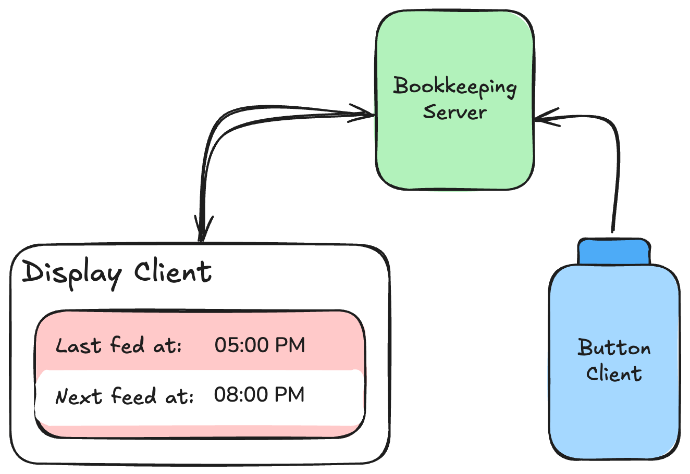

# When should we expect the next feed again?

We used to update a dry-erase board with when baby most recently fed, and with the estimated time of the next feed (3-4 hours later).

This turned out to be super helpful! It helped us better plan what we did between feeds, and helped us better read baby's cues as we would be more confident at ruling out hunger.

In a true engineering fashion, the process of updating the dry-erase board was too many steps for my liking. Who wants to "erase-uncap-write-cap", when all they need to do is push one button?

Wife simply pushes a 90's arcade style button situated where she feeds baby, and instantly the corresponding displays (yes, multiple) show the updated "most recently fed at" time and "estimated next feed" time.

Though the use-case is quite trivial and clearly this is a toy project, it was fun to hack around with the raspberry pis I had around collecting dust.

## How it works explained to a two year old

Bawbawah The Bookkeeper, Clicky the Button, and Shiny the display.

Bawbawah writes down the most recently fed time and calculates the estimated next feed time. Bawbawah is very intelligenet, but lacks eyes, so relies on others to denote when the feed happened.

This is where Clicky comes in. Clicky doesn't remember anything, but is excellent at telling Bawbawah to make an update everytime someone presses Clicky.

Shiny the display is akin to the passenger who inquires "are we there yet" every 5 minutes. Shiny asks Bawbawah "what were the feed times" every 0.5 seconds. And if there is new info, Shiny will proudly display it.

## How it works explained at a high level to a computer enthusiast

Bawbawah is a web server that stores the most recently fed time in memory. Users can use an HTTP PUT request to update the feed time, and a GET request to retrieve the feed times. We implemented the server via FastAPI on a Raspberry Pi 2 Model B V1.1 (2014).

The same Raspberry Pi is connected to an eink display from Pimori ([link](https://shop.pimoroni.com/products/inky-phat?variant=12549254938707)). A separate process runs a loop that polls the server for feed times every 0.5 seconds.

A separte Raspberry Pi, the Raspberry Pi Zero W V1.1, connected to an arcade style button, runs a process that listens for button presses every 0.1 seconds, and upon presses, makes a PUT request to signal Bawbawah to update state.

Bawbawah is the central server that manages state, and all other components are clients. We can have multiple independent display clients, as well as multiple independent button clients.
