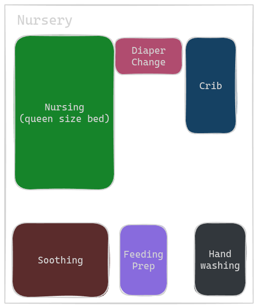
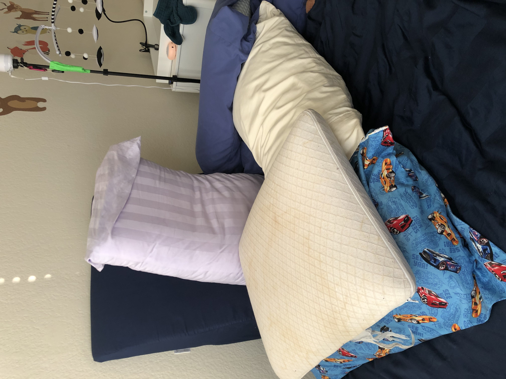

# [WIP] Baby Registry And How The Items Fit In Our Routine

This document aims to knock out two birds in one stone: a) share an informed list of battle-tested newborn products (specifically 0 to 2 months) and ones to avoid and b) share our care taking routine.

These two topics naturally go together as we find the nursery/products themselves become a crucial member of the baby rearing team.

First we overview our routine, then we detail the rooms that aid us in our routine, and the newborn products in each room.

Note that we present the final, battle tested version. Our routine has gone through many iterations.

Disclaimer: Every baby is different. Every situation is different. Our routine was influenced by our choice to exclusively breastfeed, baby's preference for tight swaddles, and the size of our village.

## Routine

At a high level, our routine centered around four phases:

1. Feeding baby
1. Playing with baby
1. Soothing baby
1. Recharge

Baby would wake every 2-4 hours. Upon waking, we feed baby. After feeding, if baby shows signs of wakefulness, we play with baby. When baby shows signs of sleepiness, we put baby to bed. When baby is sleeping, the care taking team has team to recharge.

Our caretaking team consisted of three members: mama, papa, and gma. Since mama is irreplacable for breastfeeding, and since she needs to wake up every time baby wakes up, her "chores" center on all things feeding, pumping, and milk. Whenever possible, mama would rush to bed. Papa focused on all other support tasks such as diaper changes, swaddling, holding baby's arms during feedings, and help mama time the latch. Since papa can be replaced by another support person, papa would aggresively take on as many baby soothing shifts as possible to maximize mama's sleep time. Gma would be responsible for taking care of mama and papa. Gma would feed them, hydrate them, replenish laundry, keep the house clean, and hold the baby whenever possible to afford mama and papa more sleep.

Here is a depiction of our caretaking space:

TODO: add diagram

### Feeding the baby

Baby wakes up in one of two places: the crib, or in a care taker's arms, who was resting in soothing station.

We always fed the baby in the nursery

TODO: pic of nursery

Papa unswaddles baby in the crib, and moves baby to the diaper changing station to clean baby.

Meanwhile, makes any necessary feeding preparations at the feeding station. For example, when we still needed to supplement breastfeeding with pre-pumped milk, mama would retrieve the pre-pumped milk, and prepare the feeding tube and syringe we used to transfer milk.

Next mama moves to the nursing station and adjusts the nursing pillows and lays down towels and burp clothes to absorb milk spillages and spit up.

Once both mama and papa are ready, papa moves baby to the nursing station. Papa stands by to support mama, typically restraining baby's hands from interferring with breast feeding, and either helping mama with latch timing, or with the feeding tube or syringe.

Once baby settles, papa goes to the feeding station to log notes about this specific feeding. For example, papa updates a whiteboard with time of baby's most recent feeding, and the estimated time for baby's next feed.

Baby feeds from 30 - 45 minutes, including setup changes, and burp breaks. After the feed, mama holds baby upright for 15 minutes, and then call papa to take over.

Papa proceeds to change baby's diaper and if during the day time, papa puts clothes on baby, else, baby swaddles baby.

During this time, mama pumps, if needed.

### Playing with baby

and papa would take turns putting baby to sleep if baby was really fussy, though papa would aggress

The nursery was 80% ready - all of the major blocks and components were present, though we were lacking in accessories/smaller items that were needed to efficiently care for the baby, such as a shortage of linens.

Below we will describe the components, and their respecitive missing items

### Soothing baby

TK

### Recharge

TK

## Baby Registry by station

### Nursery

Let's start with the battle tested products.

1. Crib

   1. Crib ([link](https://silvafurniture.com/products/serena-convertible-crib))

      1. Hardwoods only, and water based finish, greed guard certified -> minimal VOCs emission
      1. Pricey, but built to last -> can convert eventually to full size bed

   1. Mattress ([link](https://www.amazon.com/dp/B0817CS1D4/ref=br_dsk_yr_item_seebyopt?colid=1WJ6CRJNFGWAS&coliid=I1PZXNL53BNWZ7))

      1. gots and greenguard certified
      1. waterproof coating
      1. comes with breathable cover that allows air to flow under the baby -> e.g., in theory babies can breathe through it, so if they accidentally roll over onto their stomach, and their face is pressed against the bed, they can, again, in theory still breath. This is per marketing on their website. I have not personally tested and am not a medical professional, nor am I giving trustworthy advice. These are my personal opinions. Please consult your medical professional, and do not hold me liable.

   1. Breathable mattress cover (if mattress does NOT come with one, [link](https://www.naturepedic.com/baby/bedding/organic-breathable-crib-cover))

   1. Baby monitor ([link](https://www.amazon.com/Babysense-Split-Screen-Monitor-Two-Way-5000mAh/dp/B0BRYFD1YT?pd_rd_i=B0BRYFD1YT&ref_=pd_bap_d_grid_rp_0_1_ec_cp_pd_rhf_se_s_rp_c_d_sccl_2_17_t))

      1. Not wifi based, so even if there is an outage monitor will run

   1. Temperature monitor near the crib (NOT in!) ([link](https://www.amazon.com/LittleHippo-Changing-Customizable-Thermometer-Hygrometer/dp/B078Z4JCJL?pd_rd_i=B078Z4JCJL&psc=1&ref_=pd_bap_d_grid_rp_0_7_t))

      1. This one emits, optionally, an amber light when temperature is within acceptable range, and glows blue when room is too cold, and red when room is too hot
      1. Once glance from anywhere in the room is all it takes to confirm whether room temp is okay

1. Diaper Changing Station
   1. Mobile for changing table ([link](https://www.amazon.com/Montessori-Mobile-Baby-Rotate-Musical/dp/B088TCNZ52/ref=sr_1_6?crid=2O2BJ8OOAECS4&dib=eyJ2IjoiMSJ9.wE6QblDK5gMManqpkWFAKcobYYOTIIv88jdfCNkIjHxYpYp6JUgsjINGZWPG50DxVHpubdklhNDsEPw77Z-mC5NvrSZ_X80p-73xDHApDwOCw4ypzSbqFh3THnfcjbZmY571mvAjwgb6PPsFclZGOEqr5L58j7NpB9gUN1ho8K5sC7op98G8PDTMPG9PkiVFYmSTEz9S3XAphAbIDmNsyxTw6XsUbicISAWwBehXk_D0SYFwKvzeG5C0PoRCVl9NCKJQlC-bbocoq-d5YVFqrs-yJTVTwT9eiXaCz3g3icA.pAdzrY8p39-9T4_stM_ECNTxONFaJzSU8JvAVqwA7Qg&dib_tag=se&keywords=high+contrast+baby+mobile&qid=1720456036&sprefix=vi%2Caps%2C142&sr=8-6))
      1. Get high contrast -> baby cannot see well in the first few months
      1. We remove the music/rotation box as it is too heavy, and if the mechanism fails, we don't want anything heaving crashing down on baby
   1. Changing table lamp ([link](https://www.amazon.com/gp/product/B0BWDN69HN/ref=ppx_yo_dt_b_search_asin_title?ie=UTF8&psc=1))
      1. Clamps onto the changing table
      1. Can adjust light temperature (useful to use orange light during night time)
   1. Dresser as changing table ([link](https://babyletto.com/products/bento-3-drawer-changer-dresser-with-removable-changing-tray?variant=39504944398390&nbt=nb%3Aadwords%3Ax%3A16408512883%3A%3A&nb_adtype=pla&nb_kwd=&nb_ti=&nb_mi=134418441&nb_pc=online&nb_pi=shopify_US_6596974542902_39504944398390&nb_ppi=&nb_placement=&nb_si={sourceid}&nb_li_ms=&nb_lp_ms=&nb_fii=&nb_ap=&nb_mt=&tw_source=google&tw_adid=&tw_campaign=16408512883&gad_source=1))
      1. greenguard certified
      1. Ideally, to lower VOCs emissions even more, we would've gotten dressor with zero engineered wood, butnot ideal in that there is still engineered wood, but then price into the $1000 plus range
      1. Top drawer
         1. diapers - we prefer Lil Snugglers By Huggies ([link](https://www.amazon.com/HUGGIES-Snugglers-Diapers-CONVENIENCE-Packaging/dp/B00J7PIH2C/ref=sr_1_4?rdc=1&s=baby-products&sr=1-4))
         1. aquafor for diaper rash ([link](https://www.amazon.com/dp/B0107QP1VE/ref=br_dsk_yr_itemdt_dp?colid=1WJ6CRJNFGWAS&coliid=I2F64B2YFXFVJB))
         1. wet wipes ([link](https://www.amazon.com/gp/aw/d/B07SH6HN2X/?_encoding=UTF8&pd_rd_plhdr=t&aaxitk=d82da6ab528c184cee6c0e8e2ad8e9ec&hsa_cr_id=1879465430801&sr=1-1-9e67e56a-6f64-441f-a281-df67fc737124&ref_=sbx_be_s_sparkle_lsi4d_asin_0_title))
            1. we chose unscented wet wipes that are over 99% water and are hypoallergenic
         1. dry wipes ([link](https://www.amazon.com/Honest-Company-Organic-Cotton-Wipes/dp/B08CYBPHNF/ref=sr_1_2?rdc=1&s=baby-products&sr=1-2))
            1. helpful for super delicate or tender skin, and for drying
      1. Middle drawer - linens - try to get OEKO-TEX certified, or GOTS certified
         1. swaddles - more info below
         1. At least 6 burp clothes. ([link](https://www.amazon.com/dp/B0CLPGQWNB/ref=br_dsk_yr_item_seebyopt?colid=1WJ6CRJNFGWAS&coliid=I25EKXODNIGTVK))
         1. 3 portable micro fiber towels for when baby pees on the changing pad ([link](https://www.amazon.com/Syourself-Microfiber-Sports-Travel-Carabiner/dp/B01K4HV4EO/ref=sr_1_8?crid=1LBVI454CNVKK&dib=eyJ2IjoiMSJ9.1V_dDurcMwJkX7hYZkXH5d0j27wnEWHjBlTJ47DMGouKmm1tKoMr4RmVj1OmmajQFpaIBVnbtMtv09ee0lxdZudRTAWZjFCSId47_q8tXb3DeoybGl78wgPD6reGPzc3aVsManoRqZD5D0h7-X1odIUevhIQNPzWhS_PLO_xEcQoOqbnrS6ArseXC8w1FhveH6OTiQzuITeYrUWrlaKKyuMRlKYXpBvtEwGj_FXdoS3tXv_bTW0NN8O2Ks2clPoSF7XyqKfNp9xpKy0MUsCZDmcGU62VchCg6rwJJanEO4w.DbAQDQTxOB6ynrv6jGdhRdmR0dck5JiTd5ZaazdTp_g&dib_tag=se&keywords=portable+microfiber+towel&qid=1720456636&sprefix=portable+microfiber+towel%2Caps%2C167&sr=8-8))
         1. At least 2 spare bed sheets ([link](https://www.target.com/p/fitted-jersey-crib-sheet-safari-stripes-2pk-cloud-island-8482/-/A-89298943#lnk=sametab))
         1. wash cloths ([link](https://www.amazon.com/Burts-Bees-Baby-Washcloths-Absorbent/dp/B081SFF4PD/ref=sr_1_5?crid=1Z3AGDJ69D71J&dib=eyJ2IjoiMSJ9.BJ_5UX5B7OMLOkPlhVTy2idOFum0dmNSnybwjojZFs61Rjbgu-9-pvGFPSMVZG4SsMir7EW3XDEax4PAz5fa321cb1fv_hOnw_7tCe27Q8mCNa6HDPiIyMz6CxAnBSW4JBeR8r9SLxeczvJqpFekbqoda6hEtwjbtwTcAxbWX7pi-Pn9kb8pLoZd1t7qabihLFdN2Y6UrbHJDu_-RYsEu2RtggZaqoZ2eMsy81rvvfwEGx-wbyXzjv8CNnHn63Molxmz4ULlZWvGpj2hRm3mUn4Dfy9hojSlpbtjwBv1OQI.RerIJPupAvCEzKMkL-GkMGiv7Hc2rrR75G0MLjXRFqU&dib_tag=se&keywords=baby+wash+cloth&qid=1720456776&sprefix=baby+was+%2Caps%2C162&sr=8-5))
         1. 2 baby towels ([link](https://www.amazon.com/dp/B0BHYDPWVQ/ref=br_dsk_yr_itemdt_dp?colid=1WJ6CRJNFGWAS&coliid=I2YMVQQ72G38KU))
      1. Bottom drawer - baby clothes - more info below
   1. Diaper pail ([link](https://www.amazon.com/dp/B01049VXFM/ref=br_dsk_yr_item_seebyopt?colid=1WJ6CRJNFGWAS&coliid=I2SUAYED7QOWWB))
   1. Soiled linens basket ([link](https://www.target.com/p/natural-woven-round-storage-bin-with-coiled-rope-handle-cloud-island-8482-m/-/A-83666598#lnk=sametab))
1. Nursing station
   1. nursing pillows - more below
   1. Clock ([link](https://www.amazon.com/Foxtop-Non-Ticking-Operated-Decorative-Classroom/dp/B07RS18VQ4?pd_rd_i=B07RS18VQ4&ref_=pd_bap_d_grid_rp_0_1_ec_pd_rhf_se_s_rp_c_d_sccl_2_5_t))
1. Feeding Station
   1. Dressor for feeding prep station ([link](https://babyletto.com/products/gelato-3-drawer-changer-dresser-with-removable-changing-tray?variant=1794434531352))
   1. Fan
   1. Bottle rack holder ([link](https://www.amazon.com/dp/B00RQ83N76/ref=br_dsk_yr_itemdt_dp?colid=1WJ6CRJNFGWAS&coliid=I3GXG55TCSCD7U&psc=1))
   1. Whiteboard ([link](https://www.target.com/p/u-brands-11-34-x14-34-contempo-magnetic-dry-erase-board-white/-/A-50525359#lnk=sametab))
   1. notebook
   1. Vitamin d, gas drops, gripe water
   1. disposable syringes for gas drops and gripe water
   1. Fan to circulate air throughout the room ([link](https://www.amazon.com/Dreo-Bedroom-Circulator-Airflow-adjustable/dp/B0BSH75KZ3?pd_rd_i=B0BSH75KZ3&ref_=pd_bap_d_grid_rp_0_1_ec_nped_pd_rhf_se_s_rp_c_d_sccl_2_12_t)) - lowers SIDS risk
   1. Night light ([link](https://www.ikea.com/us/en/p/aftonsparv-led-table-lamp-rocket-multicolor-10555235/))
1. Handwashing
   1. Scentless hand soap ([link](https://www.amazon.com/Seventh-Generation-Hand-Clean-Unscented/dp/B00LR21BBM/ref=sr_1_6?rdc=1&sr=8-6))
1. Soothing station #1

   1. glider - no recommendation as we inherited one from early 90s

1. Bathing Station

   1. TK

1. Recharge
   1. Hand lotion that we apply after baby is in bed ([link](https://www.amazon.com/Gold-Bond-Ultimate-Intensive-Healing/dp/B00A8S6HM4/ref=sr_1_2_sspa?sr=8-2-spons&sp_csd=d2lkZ2V0TmFtZT1zcF9hdGY&psc=1))

Let's discuss swaddles in more detail. Nurses will teach you how to swaddle in the hospital. As a first time parent, I found using the exact same type of blanket as the hospital was quite helpful ([link](https://www.amazon.com/PILL-THING-Swaddle-Hospital-Receiving/dp/B085LSX4RX/ref=asc_df_B085LSX4RX/?gad_source=1&hvadid=693129867965&hvdev=c&hvdvcmdl=undefined&hvlocint=undefined&hvlocphy=9032172&hvnetw=g&hvpone=undefined&hvpos=undefined&hvptwo=undefined&hvqmt=undefined&hvrand=6728397118804932852&hvtargid=pla-1251729297828&mcid=02f02015aba932edb7642ff8b0def27f)). The fabric is the easiest fabric type to create a tight swaddle with as there is zero stretch. If you pull the fabric tightly, it stays tight. Unfortunately for us, there were out of stock when we most needed them. Hence, we moved on to other, more popular fabric types: jersey cotten w/spandex, and muslin.

Personally I find the jersy cotten w/spandex material the 2nd best to create tight swaddles with. The fabric stretches locally, meaning that it stretches in response to baby's arm movement, without deforming any of the swaddle folds. The fabric is also stiff enough such that we can pull it tightly. The fabric is lighter weight than the hoppital fabric, which is better for both warm weather and layering. Though I find the hospital receiving blankets still better for the tightest swaddles, I find the jersey fabric allows baby to more naturally move (yay spandex), and thus, this fabric has become my personal favorite for swaddling. ([link](https://www.target.com/p/jersey-swaddle-baby-blanket-gray-3pk-cloud-island-8482/-/A-86859047#lnk=sametab))

Then there are muslin blankets. The fabric here is "spongy", more lightweight than jersey, and highly breathable. More moisture wicking than jersey material. Personally I found it more difficult to swaddle a squirmy baby tightly with muslin since the material is too stretchy and spongy. The fabric would stretch out and later bounce back when pulled on tightly, as opposed to creating a tight wrap. Our baby's arms would escape this swaddle very easily. ([this](https://www.target.com/p/muslin-swaddle-blankets-adventure-cloud-island-8482-blue-3pk/-/A-80189660#lnk=sametab)). Would not recommend for a squirmy baby.

Swaddling takes time to learn, takes time to execute, and if done incorrectly, if baby breaks out of swaddle and throws around loose fabrics, SIDS risk increases. And if too tightly wrapped around the hips, may harm baby's hip development. I recommend moving away from swaddle blankets to a swaddle style sleep sack as soon as possible.

Think of a swaddle style sleep sack as a velcro assited "speed swaddle". Time to swaddle decreases by 5x, and if purchasing the correct sleep sack, baby can keep hips loose, and cannot break out of it. We do not recommend a velcro swaddle like this ([one](https://www.amazon.com/dp/B09Q4R94ML?ref=ppx_yo2ov_dt_b_product_details)), where the fabric that traps the hands by the hips goes all the way up to the neck line. If baby squirms, and moves arms up towards head, baby will also move the entire swaddle. If the swaddle is slightly on the bigger side, then the fabric will move up and over baby's mouth and nose, which certainly doesn't bring mama and papa peace of mind. We also find the hip area too tight.

We recommend swaddle sleep sacks such as the [halo swaddle](https://www.amazon.com/HALO-Sleepsack-Micro-Fleece-Swaddle-Newborn/dp/B001CWD0NY/ref=sr_1_5?crid=33PCP9S0K48L1&dib=eyJ2IjoiMSJ9.0AemKFw05u87tGkhkmWVkRALuW53NzhJ0f61f8HicD10u0DZlnav4p8IaOQE8-wEKRaduiGSldbMXKosZ52Mjd5KzCPMxE2i0Up33I9zGVwk5edd5t3Nm3jgloZCO9XGJtYHlCY_4tFs1bNiQO-Xoo9raejzlRl1owQGZyhqhZE8e2N3a8ml_jOsv2ILEPNtrJkGeW4HqPk7nR047yjgJm1nIA_Kq5ucPFtJklRXU9aQd596hmlZ9uYe3q64SrO1Ishjl-kzd5yT_45JfyIuaXdkYS5zhPiTK84EDO2t3Uw.0XOvRITTRFuzM1ONMn0zfvgJd3US01_LsefdGJ5HDxs&dib_tag=se&keywords=halo+sleepsack+swaddle&qid=1720461045&s=baby-products&sprefix=hal%2Cbaby-products%2C182&sr=1-5), and the [happiest baby sleepea 5 second swaddle](https://www.amazon.com/Happiest-Baby-Sleepea-5-Second-Swaddle/dp/B08XZXSS3L/ref=sr_1_22?crid=2BMWG12JXDMAI&dib=eyJ2IjoiMSJ9.HfZQDpRQQ0mzc9gRxM6a9IzpPfLacj-svaqxVIy5VbUGjY3Ds8EYH71QorqBoMYS6u4G_F0hAtaUfcVFIO6oY2tJG6-x_PTiacL3Fq7n6IWjIfEj6cZ-IqmVGurBtQlNdZzDDUjwKZTKBEzm-pzH04Z1bnXDfdPOnyuSPpeX_t6UyPYk6hX3A7qqBJnwqWmD9A5MSXqj1xRtg7e3d0Rrdn7i0JgeP8VZGyHR7jz_HO8I09ScVf74aC1Ty88z_-0AgSYFbXEw_Q4GJC_zWbjqgIFrAm9BKFTjujY0eyIc8ik.AnadJ1ep2UxhIT38NRkagxU7JmDursg7typtOkJPzsU&dib_tag=se&keywords=happybaby+sleep+sack&qid=1720461069&s=baby-products&sprefix=happybaby+sleep+sack%2Cbaby-products%2C129&sr=1-22). Both of these swaddles have a separate fabric to restrain the arms that can be positioned such that even squirmy baby cannot raise fabrics over baby's face. They also provide loose hips. What's nice about the halo is that there are different temperature rating fabrics for different weather conditions. A downside of both, is that they do not come in premie sizes.

Let's discuss newborn clothes in more detail. We prefer [body suits](https://www.amazon.com/Simple-Joys-Carters-Short-Sleeve-Bodysuit/dp/B07GP7CGN7/ref=sr_1_7?crid=2AS9VM6RJ6SIB&dib=eyJ2IjoiMSJ9.YWhCUUe9596_cpN6tLP2p752gBD1fAEKBbAiq3fEhQtpx1g2RgTi4GPk7Pd-XSO8FXUvB7O_qFGaM8LaslEUe286KBMBlVs-_H4rASaXYsdOqsJ9GsjoVQDU_Txf8B4HIOpn8c7fetNsr2d5kddWplqt7uwN9oJns91OqtX8Xf98r2tX5kJkHWzituVlUYUNj6pvAmKyiu_9bbzIkggEgjDAPnt0TUDcFTGWrzpv6c87mGzU8NL4H7FqdmZhGSGi1K3UCxTv7O2tgE7HVz3_kxkkgf08kO2Xy0SsHpMqBww.zmx0O68I8Z6VL7IecjBjwJKRtxeb1ZK26vQc_n7S6zs&dib_tag=se&keywords=newborn+body+suit+carters+simple+joys+short&qid=1720461317&s=baby-products&sprefix=newborn+body+suit+carters+simple+joys+shor%2Cbaby-products%2C137&sr=1-7) during warm weather, and [onesies](https://www.amazon.com/Simple-Joys-Carters-3-Pack-Rainbows/dp/B08G8TDFT7/ref=sr_1_1_sspa?crid=1WUFHFI61PAG0&dib=eyJ2IjoiMSJ9.HDKE0RevfItQFFzcNF1FcU3P2FL9pC2kCvgSNpRdH2Boo53vliun6rodjySjZjvVBtBwrS0xogVrsQTamAhR_vRxh0yziOJRZaBJL0SSWd7S5Sn-hTM9PkyCKiLNo7WQQB5XueIGHhmhJOB6yy3l7dDwlx-sRQYaTaQsclQtE8Jq0Xl3xOkNFNf4Zq2Odg79gR4lirsgaBrvdfQR3Px1gxpkQoHyLjPLJ3JivfmenEnSsL3s4AiZzpncrW0LkutPRKN_0WnsxG-gKhQdT1FA2554ZPvEpicZX4jArmIltUk.zJQp6sPpyW6AxFZ092oeWRPFdpU-CFQdIMWrb4d0NkA&dib_tag=se&keywords=simple+joys+onesie+zipper&qid=1720461363&s=baby-products&sprefix=simple+joy+onesie+zipper%2Cbaby-products%2C134&sr=1-1-spons&sp_csd=d2lkZ2V0TmFtZT1zcF9hdGY&psc=1) with two way zippers all the way down to the foot for colder weather. In first two weeks, baby always wore a [hat](https://www.amazon.com/dp/B0BBSWZB4T/ref=br_dsk_yr_itemdt_dp?colid=1WJ6CRJNFGWAS&coliid=IVCKXEBVFVEI4&psc=1).

Let's discuss nursing pillows in more detail. If baby is small, the [brest friend](https://www.amazon.com/My-Brest-Friend-Deluxe-Nursing/dp/B08J54C2Y8/ref=sr_1_4?crid=5XEH8JDEEEOX&dib=eyJ2IjoiMSJ9.NP5o72nAn0s8MuwFXoZO50NfYZKEOcaomVvpXHK3riWuoJ65h73dmyaWUuRRiidczM-GNHaIDNtNnNWxpP_V5ANEfmERR55TniDQVCaeKuqGf7mNPySSv0gMIHx6VTRafY-sPG5Haie9L3V4dVhRcEuqD5RzFhsYkv2G2XBR6gU72qmowMQg2LFd_2HkDPNFCPf_lcn_VQSCok1SHK0tIrAAF0ePPlhLIZ2bsBZzehy6SFqZiVkpBiTnWxz7FeV5TSzTQ3V_xhoo8FnJMO55HQPKcxIYsZoISxT36DsDEVI.8giVmxv31v354j9808Yip1i3Dj3wTTZWFtgKetXnRe8&dib_tag=se&keywords=brest+friend&qid=1720461882&s=baby-products&sprefix=brest+frien%2Cbaby-products%2C164&sr=1-4) and [water proof cover](https://www.amazon.com/My-Brest-Friend-Waterproof-Slipcover/dp/B004I8VFO0/ref=sr_1_1?crid=2YBMFRK9IPOQU&dib=eyJ2IjoiMSJ9.8TiMS-b3QDCs-90CjwTgB1IACgW0VN9OtAe7awUCQ_Q4lZBZqhPYJ_rR4zaAab3QIB6pSgwgN_DvcTPwqb03fVwSGqSP2zEKiLCoJWcC87kM38c8XwnRoq6xd6B7pDYMhPYhwPcMQecGI-rU3sa4iYOOEvuUUWJnE52dxxJPB01zykVCw8StxKW31L39Mco7TZyPiyHJwN5AJfDE2JlMpbxDpjL4UcC8fa_Z2TMrD-02fzNSDeP0mGDTooss__oTv8xfkBHswK_128KQAjU2lsaMePTvVA3bQu5wYEkgSmw.XIqjEtu5a_xmHjyyZA0ha1rZMgV6KKUzDQKEwPOWJZk&dib_tag=se&keywords=my+brest+friend+waterproof+cover&qid=1720461896&s=baby-products&sprefix=brest+friend+water%2Cbaby-products%2C138&sr=1-1) is your bestie. This pillow creates a sturdy platform on which baby can rest at the correct height for breast feeding.

If baby is larger, we recommend the [boppy](https://www.amazon.com/Boppy-Original-Nursing-Positioner-Allover/dp/B07XLNFBZX/ref=sr_1_5?crid=2O2BJ8OOAECS4&dib=eyJ2IjoiMSJ9.173Wc6fqHXFNadYuR_Xp_yFX2gvCyVG_5JeLMg4JNFqU4KA-iXqayKgB6rKpvUSXxaBDO-LyvAFDhnLwVBnpgt13d3bE_qn_1a8xyAAH3tqR8HcPNqrq2q7Wpe8RbMxGzxO4_8A0ZmqG-i_hzTEUXGlzZfsbNxS7e9a4ylkLCW0ffef3uFapxH0UwV55ADjegyEBx1TNljqr10IqHcLuFNntoyMz-tFh31dFjHq3zZ_5UYPyrCHy0yAGWkrefuEhdr0Zw-_-FSHAoJJhlJeQ8BNVRF53EInZ4LUwxHQRyBw.2QAMJQH5FUFNlGiRIDRixy83I2zmE0RDXGVdygyCcUc&dib_tag=se&keywords=boppy&qid=1720461977&sprefix=vi%2Caps%2C142&sr=8-5). Same idea, but less bulk/support.

If baby is tiny, we recommend essentially a DIY brest friend. We dub this our "nursing throne" or "nursing cockpit":

We made this with a [wedge pillow](https://www.amazon.com/gp/product/B09CFW2M16/ref=ppx_yo_dt_b_search_asin_title?ie=UTF8&psc=1), and a bunch of firm memory foam pillows

Next let's discuss products we had, but didn't need or do not recommend

1. Non - high contrast mobile over the crib -> baby can only see high contrast at this stage
1. Keekaro peanut - way too big for a newborn and has unnatural divet that separates head area from torso area that just unbalances baby. Also doesn't fit in standard dressing table changing pad constraints. Cold to touch and would always wake warm baby. Wipaeable, but so is a changing pad with no cover. Perhaps this will be useful for bigger baby, but not at all helpful for newborn. Prefer $30 changing pad with waterproof shell.
1. White noise machine (fan is essentially the same thing)
1. 30" by 30" blankets - Too small to swaddle with.
1. velcro swaddles whose arm constraints are too close to top of swaddle (explained why above) ([link](https://www.amazon.com/dp/B09Q4R94ML?ref=ppx_yo2ov_dt_b_product_details))

### Living Room

1. Outdoor station

   1. Rear facing infant car seat: Clek Liing, in flame retardant free cloth ([link](https://www.amazon.com/dp/B09DTG1Q4K/ref=br_dsk_yr_itemdt_dp?colid=1WJ6CRJNFGWAS&coliid=I1D27NFL458IP&psc=1))

      1. highest ranked car seat for safety by both consumer reports and baby gear lab
      1. We picked out this seat first, and looked for a compatable stroller 2nd
      1. Low VOCs.

   1. Car Window shade [link](https://www.amazon.com/Munchkin%C2%AE-Brica%C2%AE-SafetyTM-Window-Roller/dp/B00WH7Y7TY/ref=sr_1_5?sr=8-5)
   1. Baby on board stickers ([link 1](https://www.amazon.com/dp/B0B8VT4461/ref=br_dsk_yr_itemdt_dp?colid=1WJ6CRJNFGWAS&coliid=I1B5LPH2SMU6G4), [link 2](https://www.amazon.com/dp/B0B7LV1NPN/ref=br_dsk_yr_itemdt_dp?colid=1WJ6CRJNFGWAS&coliid=I3S6JGU27GAN38))
   1. Baby blanket for car ([link](https://www.amazon.com/dp/B0BQ1888PN?ref=ppx_yo2ov_dt_b_product_details))
   1. Inde All Terrain Stroller ([link](https://bumbleride.com/products/indie-all-terrain-stroller)), with maxi cosi adapters for clek liing ([link](https://bumbleride.com/collections/accessories/products/indie-speed-adapter-clek-maxi-cosi-cybex-nuna))
      1. car seat can attach to stroller
      1. Low VOCs
   1. Bassinet that mounts to stroller ([link](https://bumbleride.com/products/era-indie-speed-bassinet))
      1. Useful to walk the baby in the stroller mounted, sleep approved bassienet. If baby falls alseep, we can leave baby in bassinet, or transfer baby to crib easily
   1. Diaper bag [link](https://www.bugaboo.com/us-en/accessories/bags/bugaboo-changing-backpack-misty-grey-100089013.html?cectid=1-13079-1&gad_source=1)

      1. free standing
      1. good Internal organization
      1. lacking water bottle holders for mama/papa

   1. Nursing Cover: [link](https://www.amazon.com/dp/B0817CS1D4/ref=br_dsk_yr_item_seebyopt?colid=1WJ6CRJNFGWAS&coliid=I1PZXNL53BNWZ7)

1. Pumping Station

   1. Breast pump - consult medical professionals
   1. Timer ([link](https://www.amazon.com/dp/B07TMPRG8D?psc=1&ref=ppx_yo2ov_dt_b_product_details))
   1. Charger for baby monitor receiver (shared above)
   1. Tablet and tablet stand to entertain mama
   1. tablet stand ([link](https://www.amazon.com/Anozer-Foldable-Adjustable-Extendable-Compatible/dp/B089K6C49L?pd_rd_i=B089K6C49L&psc=1&ref_=pd_bap_d_grid_rp_0_1_ec_cp_pd_rhf_se_s_rp_c_d_sccl_2_22_t))
   1. Bottles to hold pumped milk ([link](https://www.amazon.com/Medela-Breast-Milk-Storage-Solution/dp/B006R3KBYO/ref=sr_1_10?sr=8-10))

1. Secondary Soothing Station

   1. couch with pillows to help support arms that are carrying baby
   1. pack and play ([link](https://www.potterybarnkids.com/products/nuna-sena-aire-playard/?catalogId=10&sku=6806522&cm_ven=PLA&cm_cat=Google&cm_pla=Baby%20Gear%20%3E%20Travel%20Cribs&cm_ite=6806522_14726664444_pla-327533561682&gad_source=1&adlclid=ADL-9462aa2d-f968-4336-8ed5-c4ea13d1f769)) - another sleep area for baby, that in our case, is closer to air conditioner

1. Tummy Time Station

   1. Tummy time mat ([link](https://www.amazon.com/dp/B075R8BXXC/ref=br_dsk_yr_itemdt_dp?colid=1WJ6CRJNFGWAS&coliid=I2ZXTRMG4QH0BF&psc=1))
   1. High contrast cards to stimulate baby's vision (included above)
   1. Mirrors - we found our baby responds most to mirrors (included above)
   1. High contrast books
   1. Brightly colored toys for baby to look at

- Baby Hygiene Items

  - baby nail file - super gentle ([link](https://www.amazon.com/NailFrida-SnipperClipper-Set-Fridababy-essential/dp/B01644OCVS/ref=sr_1_7?s=baby-products&sr=1-7))
    - get a curved nail file - easier to maneuver
  - baby rectal thermometer just in case ([link](https://www.amazon.com/FridaBaby-Digital-Thermometer-Fevers-Underarm/dp/B08GVN8XJL/ref=sr_1_2?s=baby-products&sr=1-2))
  - baby nose pump (we also keep on in a corner in the crib) - given to us by hospital

- Baby Gear Cleaning Station

  - scent free laundry detergent ([link](https://www.amazon.com/Tide-Gentle-Liquid-Laundry-Detergent/dp/B085V5ZMV9/ref=sr_1_6?sr=8-6))
  - eye masks for mama and papa to sleep with ([link](https://www.amazon.com/dp/B07KC5DWCC?ref=nb_sb_ss_w_as-reorder_k0_1_6&amp=&amp=))
  - Bottle Cleaning Brush set ([link](https://www.amazon.com/dp/B082PZ44M9/ref=br_dsk_yr_itemdt_dp?colid=1WJ6CRJNFGWAS&coliid=IP0ZSPBA8CICI&psc=1))
  - Mini tub for the kitchen sink to use as the "sink" for baby gear to prevent contamination - hosptial provided this for us
  - Baby Dish soap and bottle cleaner ([link](https://www.amazon.com/dp/B07S15TY3H/ref=br_dsk_yr_itemdt_dp?colid=1WJ6CRJNFGWAS&coliid=I2ZJ04QHRV1ESY&psc=1))
  - Baby Bottle countertop drying rack ([link](https://www.amazon.com/Munchkin-Fold-Bottle-Drying-Rack/dp/B00RQ83N76/ref=sr_1_7?sr=8-7))
