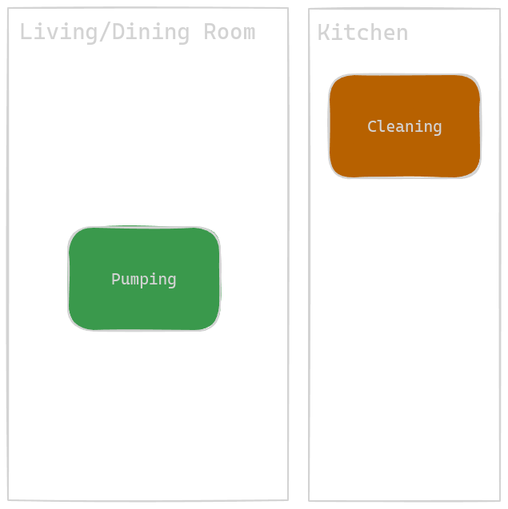

# [Work in progress] Our Caretaking Routine For the First Two Months

This document tracks the evolution of our routine as first time parents.

In broad strokes, we were still building a routine in Week 1 and operated on adrenaline, and the excitment associated with novelty. A good comparison is we were swimming in all different directions with max effort and taking sips of air to fuel more flailing. By week two, we developed a streamlined routine that put our heads above water, and let us tread water gracefully. Starting end of week two, we can slowly modify tiny bits of our routine (one thing at a time) to help baby develop (tummy time, walks, ween off of sns, etc). E.g, we can see shore, and we know how to get there slowly and steadily.

As of 6/8/24, really looking forward to establishing breastfeeding w/out any support tools, as that will enable Mama and Papa to take shifts such that both parents can sleep a consequtive 6-7 hours a night! As opposed to no more than 90 minutes every 3 hours.

# Background: Nursery as a vital supporting member

The nursery, or the space itself, is a crucial member of the baby rearing team.

We were able to iterate on a consistent, reliable space which allowed us to incrementally build a routine.

One can argue that our routine became more streamlined largely in part because we made our space more accomodating, or invested in time saving tools.

Let's first review the starting point.

We had a nursery room, and a storage room.

The nursery was 80% ready - all of the major blocks and components were present, though we were lacking in accessories/smaller items that were needed to efficiently care for the baby, such as a shortage of linens.

Below we will describe the components, and their respecitive missing items

## Nursing

This is where we feed baby. We elected to use the queen size bed where one parent also sleeps (other parent sleeps either in living room or guest room).

We were missing pillows - our lactation consultant recommended a minimum of six FIRM pillows. We were also missing a clock to easily monitor how long feedings were taking.

## Soothing

Our rocking chair lives here, and the intent of this space is to rock the baby to sleep when overloaded with fussiness.

We were missing adequete blankets for skin-to-skin time on the rocking chair, pillows to support the arms holding the baby, and a platform with which to place drinks/snacks/tablets for the one holding the baby.

## Diaper Change

We used a dressor as our changing table. Changing tables come with a rectangular "fence" to immobilize the changing pad that lives on the top of the dressor. We did NOT install that fence since we originally planned to use the Keekaro Peanut as our changing pad (foam pad advertised to be easily cleanable via wiping), which didn't fit inside the fence. The Keekaro Peanut simply rested on top of the changing table, un-secured.

The top drawer of the dressor held diapers and wipes. The bottom drawers help our complete collection of baby clothes we received as gifts.

Items we were missing:

- Swaddle blankets (We were told babies can't use blankets, so we thought to ourselves why buy blankets then?)
- not enough spare crib mattress sheets
- Premie sized clothes

## Feeding Prep

This is another dressor. We use the top of the dressor as a surfact to place bottles/nursing gear (the drawers hold Mama and Papa's clothes).

We were missing a bottle holding rack for convenience, a journal to log feeding details, and a whiteboard to quickly denote time of next feeding.

## Crib

Self explanatory. We were missing a temperature monitor (NOT to live inside the crib, just near it), and a baby monitor.

## Handwashing

A fancy way of saying the bathroom sink. We were missing fragrance free soap.

## Laundry

We were missing liquid detergent that was scent free. We only had pods, which work great for full loads, but cannot be micro-dosed for smaller, but more frequent loads.

## Storage Room

We had a room for storage that held items that either baby was too small to use, or we did not need immediately:

- baby carrier (too small)
- baby bouncy chair (too small)
- pack and play (no need to travel or go anywhere)

# Week 1 (Post Hospital)

Care team:

- Mama
- Papa
- Gma

Start: arrive home from hosptial

End: Baby turned 1 week old, and Gma no longer staying with us overnight

## Routine

The below routine repeated itself endlessly every 2-3 hours.

| Mama                                               | Papa                                        | Gma                                      |
| -------------------------------------------------- | ------------------------------------------- | ---------------------------------------- |
| Wash hands                                         | Wash hands                                  | Wash hands                               |
| Prepare nursing station (arrange pillows)          | Unswaddle & diaper change                   | Prepare milk in SNS                      |
| Feed baby with nipple shield and SNS (40 - 60 min) | Help with latch, and push milk from syringe | Help with latch                          |
|                                                    | Help with hand expression                   | Standby for help as needed               |
|                                                    |                                             | Log feeding start time                   |
|                                                    |                                             | Refill sns with milk                     |
| Clean up nursing station                           | Log feeding end time                        | Log feeding end time                     |
| Prepare to pump                                    | Diaper change                               | Prepare for skin to skin time with baby  |
| Pump (10-15 min)                                   | Swaddle baby (only if gma not present)      | Hold baby until next feeding             |
| 1-1.5 hours remaining until next feeding           | 1-1.5 hours remaining until next feeding    | 1-1.5 hours remaining until next feeding |

And we needed to attend two doctors appointments:

- 1 day after hospital pediatrician check to confirm belly button was okay
- 2 day after hospital newborn check in (typically this happens one day after hospital discharge)
  - Before hand we needed to take baby to lab to draw blood for Jaundice check

We modified our routine around these visits by timing feedings such that they conclude around 45 minutes before the time we want to arrive at the doctor's office. Baby's milk drunk state kept him asleep while we proceeded with the doctor's office logistics.

The extra steps here are to a) dress baby in premie onesie, b) secure baby in car seat, and c) pack diaper bag.

## Between feedings

In the first week, between feedings Papa would enhance each of the baby stations (one target run for swaddles on day one, many subsequent target orders, signed up for Amazon prime, then lots of amazon orders), and organize the apartment, which was a warzone of stuff from hospital, baby gifts, opened packages, and piles of donations gear.

Mama would similarly organize and get the house in order, clean and set up the pumping station, and make many target online shopping orders. She also prepared food for those of us who don't solely exist on milk.

Gma was typically on baby holding duty, and somehow endured back to back baby holding sessions seamingly with no fatigue. Did she even eat full meals? We provided water, raisins, kind bars, and pistachios. She would also urge Mama and Papa to a) do one thing at a time, b) drink water, c) sleep.

Mama and Papa would lie down and nap, but it was not a top priority, and mostly they were up working on aforementioned tasks. Mama and Papa did not eat much either.

Baby would frequently wet swaddle blanket and sheets resulting in very frequent laundry runs. The cause was poor diapering technique by Papa. In fact, baby peed on gma during their first skin-to-skin due to loose diaper.

## Upgrades to the Nursery

- Can now grab any type of non clothes linen (swaddle, towel, burp cloth, bed sheet) from one centralized drawer, and have plently extra such that we do not need to do laundry between feeds just to make sure there is, for example, a clean swaddle to sleep in.
  - Moved out most of the baby clothes in our changing table dresser to clear space for a drawer full of swaddles, burp clothes, towels, and sheets
  - Went to target and grabbed one of every type of baby blanket/swaddle available
  - Got more blankets for skin-to-skin time
  - Bought two more sets of crib sheets at Target
  - Bought soiled linens basket for baby gear
- We can now wash any number of soiled linens with unscented detergent
  - Previously we had tide pods which could not support smaller laundry loads
- Upgraded to unscented soap for handwashing, and brought out hand lotion to alleviate dry knuckles from hand washing so much
- We can now glance at a Whiteboard at the feeding prep station to see the next feeding time
- We know room temperature thanks to placing an alarm clock with a thermometer close to the crib
- 6 new pillows for nursing

### A new station for pumping

Mama chose one end of the dining table (that was close to electical outlet) as her pumping station. Later we used tape to visually section off this end of the table, and outfitted it with a tablet (and stand) for entertainment, a journal to log amounts pumped, and clothes/wipes to clean up spills or dripages.

## Adhoc Events

- Worked with lactation consulant outside of hospital who taught us how to set up the nursing station with a bunch of pillows and taught us how to align baby for the latch
- Jma stayed and held baby during late night fussiness so Mama and Papa could pass out for 2-3 hours

## Noteworthy

- Initially feedings took longer because at every feed we were using both breasts, and practiced without sns. We also needed to frequently wake baby up via burping to make sure baby could hit recommended volume
- On day 2 post hospital, when we saw lactation consulation as part of the newborn check in appointment, we were instructed that we should keep feedings betwen 20-30 minutes. We shorted the process by only sticking to one breast for feed, and cut out the non sns practice. Nurse also instructed us that our premie is a bit smaller, so we don't need to chase the full term milk volumes. Our lower bound should be 40 - 60 ml, with no upperbound. I don't remember what our previous target volume was, but this new target made it much easier to feed.
- Lots of laundry for soiled linens in the beginning due to improper diapering technique. Papa was too scared to pull diaper tightly to not hurt baby. More repetitions helped.
- We needed so much stuff. Amazon prime for the win. (sigh...everytime I try to escape Amazon...I get pulled back in somehow)
- Target curb side pick up ftw.

## Accepting Our Limitations

There was too much adrenaline and novely in the first week. Everything was new. Everything seemed important, and we couldn't feel the rhythm. Sleeping and eating were not a priority, but we both felt fine. Until, near the end of week 1 during perhaps our third or fourth "graveyard" shift.

Turns out, babies are noctorunal. They sleep so easily during day time, but are so awake and fussy at night time. For us, peak fussiness was around the midnight, and 3am feedings, where the only way to put baby down was for either Papa or Mama to hold the baby while the other parent slept until the next feeding.

Either post or pre feeding, both of us eventually independently entered a doom and mindset. This is hard. Too hard. Sleep deprivation catching up, adrenaline fading. We couldn't feel the end. Only a continous onslaught of pain for the rest of eternity. Where is baby's return policy. On top of this, Mama also felt like a failure of a mother/woman for not being able to breast feed intuitively. And for some reason, Papa forgot how to breathe while asleep and kept mouth breathing and likely developed sleep apnea as snores would wake him up.

When the next morning came, we discussed and realized that we need to carefully balance emotional energy, physical energy, and sleep. If sleep dips too low, we don't have enough emotional energy to stay present and enjoy all that there is to parenting.

Hence, we both started to take sleeping very seriously and it became TOP prioirty. After feedings, we would set a target time to fall asleep by, in order to get a full 90 minutes. Though we mostly got only 60 or 70 minutes, this was wayyyy better than before because we were hitting 5-6 naps per day (8 feedings total). It was not easy to fall asleep all the time, and Papa especially craved mental stimulation. However, for the sake of emotional health, we meditated and forced ourselves to sleep.

This mindset was a game changer. We felt much much much better and more energized. We had plenty of energy that lasted through the next feeding (but that was it sadly). This helped us stay present and playful, and fended off the late night doom and gloom emotions. It also taught us that we just don't have enough time for meal prep for Mama and Papa. We need pre-pepared food, until baby sleeps for longer, or we no longer both need to be present for feeds and can take shifts.

To summarize, we learned we can't do it all, we must desparately claw and fight for sleep, and we must delegate food prep.

## By the end of week 1

- Found a rhythm: Feed, sleep 5 out of 8 feedings, repeat. NOTHING else
- Validated this rhythm works, and able to maintain it independently
- Needed others to order us food, or to bring us prepared food

# Week 2

Care team:

- Mama
- Papa

Start: First day Gma had to return to work and could not stay overnight

End: After the two-week check in doctor's appointment

## Routine

This routine repeated every 2-3 hours

| Mama                                                                       | Papa                                                     |
| -------------------------------------------------------------------------- | -------------------------------------------------------- |
| Wash hands with fragance free soap                                         | Wash hands with fragance free soap                       |
| Arrange pillows in nursing station                                         | Unswaddle and gently wake up baby                        |
| Prepare supplementary milk                                                 | Diaper change                                            |
| Enter nursing station and await papa to bring baby                         | Bring baby to mama                                       |
| Feed baby for 30 min                                                       | Help out when needed, otherwise micro nap                |
| Burp baby (skin to skin time)                                              | Update feed log (volume and duration)                    |
| Clean up feeding parts                                                     | Diaper change & swaddle baby                             |
| Pump                                                                       | Monitor baby while Mama pumping                          |
| Clean pump parts                                                           | Temperature control room (adjust windows, fan, a/c, etc) |
| Soothe baby if needed (mama and papa take shifts), or rush to food, or bed | Soothe baby if needed, or rush to either food, or bed    |
| 1-1.5 hours remaining until next feeding                                   | 1-1.5 hours remaining until next feeding                 |

## Between feedings during waking hours

Remember that Mama and Papa rushed to bed 5-6 out of 8 feedings. For the 2-3 feedings where we were awake, here is what we did.

- Make incremental updates on the nursery to stream line our workflows
- Call friends/family
- Eat
- Papa: blog about what the hospital stay experience was like

## Nursery upgrades

- Added baby monitor to enable Papa to leave baby's side while Mama is pumping
- Added curtains for increased privacy and softer light
- fan to circulate air to lower risk of sids
- drying rack/bottle holder in feed prep station
- pumping station sectioned off
  - added timer so Mama doesn't need to do arthimetic to figure out how long she's been pumping for
  - cable organizers to reduce clutter
  - tablet stand to hold entertainment device at ergonomic height
- Lots of pillows for nursing station - trying to find pillows that don't shift as much during feedings
- thermometer that changes color once room falls outside of acceptable range -> at a glance judgement to decide whether room temp is okay

## Conclusive moment of first two weeks

Pediatrician approval to let baby sleep up to 4 hours between feedings. Baby ended up sleeping around 3.5, as opposed to being woken at 3. This was a game changer for us. The extra 30 minutes makes the difference betwen a full REM cycle of sleep or not. Emotionally we felt a huge burden being lifted.

We also now can start weening off of SNS, which gives us hope for even more sleep.

# Week 3

Care team:

- Mama
- Papa

Visitors:

- Gma

Start: After the two-week check in doctor's appointment

End: Bubbe enters the fray

## Routine

To baby's waking block, added walks, tummy time, and bath

Try to ween off of sns - tough lots of emotional struggle around breast feeding

wondering if nipple will heal, or if will just have to be prepared to endure lots of pain for a while

take the week off to let nipp-le heal

started to use home theatre as a soothing station during graveyard shift

- move meds to pumping station as that is where mama is most frequently located when free to think about non baby things

- baths

- walks

- tummy time

## Between feedings during waking hours

Remember that Mama and Papa rushed to bed 5-6 out of 8 feedings. For the 2-3 feedings where we were awake, here is what we did.

- Make incremental updates on the nursery to stream line our workflows
- Call friends/family
- Eat
- Papa: blog about what the hospital stay experience was like

## Nursery upgrades

- tummy time
- bath time
- bassinet walking time
- home theatre as an extra soothing station

## Conclusive Moment of Week 3

Lactation consultant gave us okay to start weening off SNS and nipple shield

# Week 4

Care team:

- Mama
- Papa
- Bubbe

Start: Bubbe enters the fray

End: Father's day

## Routine

start weening: more no-sns and no-shield time

DoDo videos as pain distraction

Mama got sick - we suspected breast infection, not the case, likley from papa compresing too hard
Likely mama relaxed cuz bubbe here to reliev A LOT of work from us

more tummy time as baby is awake for longer

# Week 5

Start: Father's day
end:

## Routine

officially no more sns, just nipple shield to start, and then bare breast to finish

baby officially tracked mama as she moved from left to right

# Appendix

## Scratch notes

we got into a rythm, patterns emerged, routine emerged. Doing the same thing every three hours again and again really helps you notice the smallest of deviations.

We learned hard lessons, namely, gotta claw and force self to sleep.

We both felt doom/gloom during the graveyard shift.

We were missing swaddles and baby mointors, and din't have amazon prime.

it was hard to remember the next feeding

paper work everywhere

every 1st time was nerve wracking. By the 10th time, we're okay.

Time moves slowly. One day equals 8 feedings. To us, every feeding felt like a day.

Game changer: we do not need to wake baby every 3 hours to feed. We can listen to baby's queues, but just make sure to don't exceed 4 hours with no feeding.

Baby naturally starting waking up every 3.5 hours. That extra 30 minutes was huge! Both physically (full REM cycle) and emotionally.

Now we like our routine, and dislike disruptions to it.

Support wise, need help with meals still

Need time to experiment with weening off of SNS, and adding in walks, and baths

Every moment was awesome. Baby is very cute. Feels great to be able to physically express your love.
